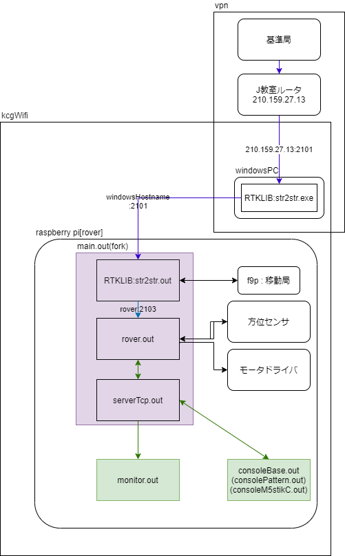

# ROVERについて

## wringPiインストール
sudo apt install wiringpi

## wiringPiのraspberryPi4向けアップデート方法[[参考]](http://wiringpi.com/wiringpi-updated-to-2-52-for-the-raspberry-pi-4b/)

gpio version 2.52がインストールされていればアップデートが必要無い  

・version確認コマンド
> gpio -v  

・アップデートコマンド  
> cd /tmp  
> wget https://project-downloads.drogon.net/wiringpi-latest.deb  
> sudo dpkg -i wiringpi-latest.deb  

## 環境変数の設定(必須)
> cd ./envVar  
> echo  "PRO4_ROVER_DIR_PATH=\"roverディレクトリのパス\"" > pro4_rover_path.path  
> source ./addEnv.sh  

再起動ごとに必要

## 環境変数の設定(永続)
/etc/profileに環境変数を追加する
PRO4_ROVER_DIR_PATH="roverディレクトリのパス"

## 配線
| RaspberryPi4    | PIN  |
|:-------------------:|:------------:|
| GPIO12                |	モータドライバ_DIR1 |
| GPIO5                 |	モータドライバ_PWM1	|
| GPIO13                |	モータドライバ_DIR2 |
| GPIO6                 |	モータドライバ_PWM2	|
| GND					| 	モータドライバ_GND	|
| 5v					|	B+	|
| GND					|	B-	|

USBにF9P接続  
*方位センサーのピンを追加すること  

## f9p
rtklibのstr2strを利用してf9pによるRTK法の結果をTCPで受信する。  
RTK法の結果のTCP配信はv2.4.3でなければできない可能性が高い。[[参考]](https://github.com/tomojitakasu/RTKLIB/issues/573)  
f9pの使い方については[詳細](./src/main/f9p/f9p.md)を確認
  
## システム構成図

  
## ROVERシステムとは
複数のプログラムを同時に動作させることで動作するシステムである。  
現在のROVERシステムはRTK法や方位センサを利用しながら、受信したデータに従ってモータドライバを操作するものである。  

## プログラムについて
./src/main内のプログラムはROVERシステムを動作させるために必須。  
./src/sub/consoleBaseはROVERの動作を補助するためのもののため、実行しなくてもROVERシステムは動作する。  
各プログラムは基本的に./serverTcp.out実行後でなければ、動作しない。  
./src/subディレクトリ内のプログラムのsendTypeオプションは送信するtcpStruct構造体の形式を決定する  
### ./src/main/server
> cd ./src/main/server  
> sh gccServer.sh  
> ./serverTcp.out   

### ./src/main/main
> cd ./src/main/main  
> sh make.sh  
>  sudo -E ./rover.out  myTcpServerAddress [f9p_adress f9p_Port]  

-Eオプションは環境変数をsudoでも利用するために必要。  
オプション[f9p_adress f9p_Port]がなければ、RTK法の結果を取得しようとしない。  
方位センサーが接続されていなくても動作するが、接続していないときは幾つかの機能が使えなくなる  

### ./src/sub/consoleBase
> cd ./src/sub/consoleBase  
> sh gccConsoleBase.sh  
> ./consoleBase.out myTcpServerAddress sendType  

### ./src/sub/consolePattern
> cd ./src/sub/consolePattern  
> sh gccConsolePattern.sh
> ./consolePattern.out myTcpServerAddress sendType  

### ./src/sub/myMonitorTcp
> cd ./src/sub/myMonitorTcp  
> sh gccMyMonitorTcp.sh  
> myMonitorTcp.out myTcpServerAddress  
