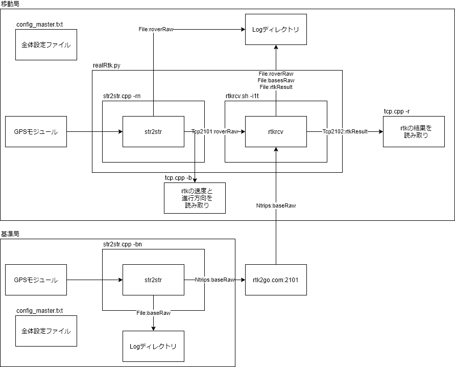

# config_master.txtについて
このファイルは自作基地局のパスワードを含むため、gitに不用意に上げないように注意する。  
必要なパラメータが最低限のconfig_master.sample.txtを確認できるようにしてある。  
パスワードの管理方法などはチームメンバと相談する  

# 利用しているRTKLIB内のアプリケーション
## プログラム内で利用するもの

|アプリ|機能|目的|
|--|--|--|
|rtkrcv|リアルタイムポジショニング(CUI)|rtk法による計算|
|str2str|通信サーバ(CUI)|モジュールデータの配信|

## 今後利用予定
|アプリ|機能|目的|
|--|--|--|
|convbin|後処理分析|ログデータからパラメータを変えてRTK計算を行うこと|

## windowsPCで利用
|アプリ|機能|目的|
|--|--|--|
|rtkplot|プロットソリューション|リアルタイム処理や後処理によるRTK法の結果を視覚的に確認すること|

# ディレクトリ構成
<pre>
.
|-- RTKLIB		(配布されているファイル本体)  
|   |-- .git
|   |-- .gitattributes
|   |-- .gitignore
|   |-- app/
|   |-- bin/
|   |-- brd/
|   |-- data/
|   |-- doc/
|   |-- lib/
|   |-- readme.txt
|   |-- src/
|   |-- test/
|   `-- util/
|-- log			(取得したデータの格納用)
`-- rtk_user_sh		(ユーザプログラム格納用) 
    |-- .gitignore
    |-- README.md
    |-- config_master.sample.txt
    |-- config_master.txt
    |-- img/
    |-- realRtk.py
    |-- rtkInstall.sh
    |-- rtkrcv.nav
    |-- rtkrcv.sh
    |-- str2str.cpp
    |-- str2str.out
    |-- tcp.cpp
    |-- tcp.h
    |-- tcp_main.cpp
    |-- test/
    `-- システム構成図.drawio
</pre>

# ログディレクトリ構成
<pre>
./log
|-- %04d-%02d-%02d_%02dh%02dm%02ds  (日付_時間)
|   |-- rtkConfigFile.conf
|   |-- baseRaw
|   |-- roverRaw
|   `-- rtkResult
|-- %04d-%02d-%02d_%02dh%02dm%02ds
|   `-- roverRaw   
`-- %04d-%02d-%02d_%02dh%02dm%02ds
    `-- baseRaw

</pre>

# 目的別システム構成
|--- 	|---		|>				|移動速度と移動方向のデータ|
|:---	|:---:		|:---:			|:---:			|
|---	|---		|必要			|必要無い		|
|rtk2go	|利用する	|realRtk_Ntrips	|rtkrcv_ntrips	|
|^		|利用しない	|realRtk_tcp	|rtkrcv_tcp		|

# システム構成図(realRtk_ntrips)

